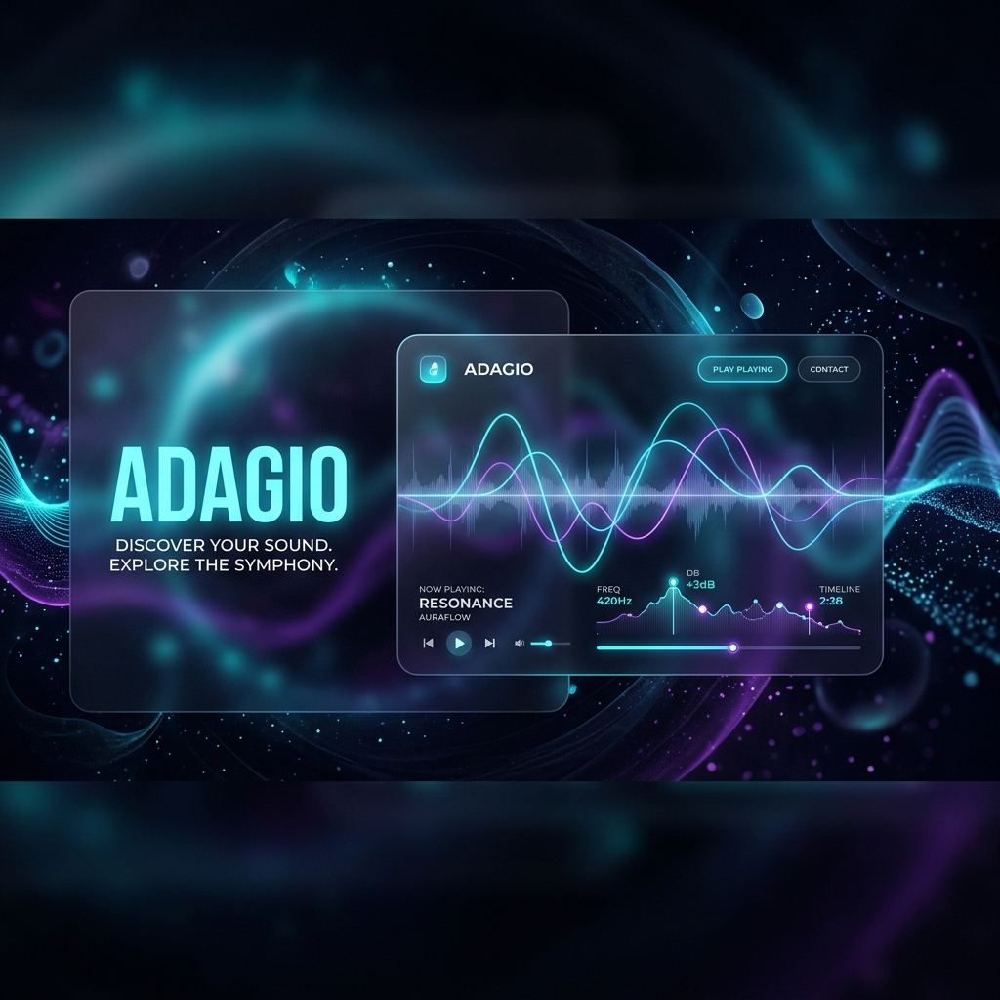

<div align="center">



# 🎵 ADAGIO
### *Intelligent, Research-Grade Music Discovery & Recognition*

[](https://nodejs.org/)
[](https://www.electronjs.org/)
[](https://ollama.com/)
[](LICENSE)

---

**Adagio** is a premium, locally-hosted desktop application that bridges the gap between **Local LLM Intelligence (Ollama)** and **Global Music Ecosystems**. Purpose-built for Master's-level research, it ensures 100% data privacy while providing state-of-the-art music recognition, mood analysis, and intelligent discovery.

[🚀 Get Started](#-installation) • [✨ Features](#-key-features) • [🛠️ Architecture](#-project-architecture) • [📖 Documentation](docs/Adagio_Manual.md)

</div>

---

## ✨ Key Features

<table width="100%">
  <tr>
    <td width="50%" valign="top">
      <h3>🧠 Intelligent Search</h3>
      <p>Use natural language (e.g., <i>"Give me some dark, energetic techno for late-night coding"</i>). Adagio curates 8 verified global hits based on your specific mood and request.</p>
    </td>
    <td width="50%" valign="top">
      <h3>🛡️ Anti-Hallucination Guard</h3>
      <p>Every AI recommendation is cross-referenced against the <b>Spotify Developer API</b> in real-time. Results are discarded if they don't exist in the official database—ensuring 100% accuracy.</p>
    </td>
  </tr>
  <tr>
    <td width="50%" valign="top">
      <h3>🎭 Mood Analysis</h3>
      <p>Using AI, Adagio extracts the <i>emotional essence</i> of any track, generating a custom UI color palette and descriptive mood string from lyrics or titles.</p>
    </td>
    <td width="50%" valign="top">
      <h3>🎙️ Acoustic Fingerprinting</h3>
      <p>Upload a file or use your microphone. Adagio uses <b>ACRCloud</b> and <b>AudD</b> APIs to identify any song playing in the environment—the Shazam experience, built locally.</p>
    </td>
  </tr>
  <tr>
    <td width="50%" valign="top">
      <h3>📺 Official MV Streaming</h3>
      <p>Integrated with the <b>YouTube Data API v3</b>, Adagio prioritizes <i>Official Music Videos</i>, filtering out covers and lyric videos to provide the purest artist vision.</p>
    </td>
    <td width="50%" valign="top">
      <h3>📝 Deep Lyrics Insights</h3>
      <p>Beyond words: Adagio provides AI-generated music critic insights, summarizing the deeper narrative and metaphors hidden within song lyrics.</p>
    </td>
  </tr>
</table>

---

## 🚀 Installation

### 1. Prerequisites
*   **Node.js v20+** (Required — see `engines` field in `package.json`)
*   **FFmpeg** (Included via `ffmpeg-static` for audio slicing)
*   **Ollama** installed locally. Adagio auto-selects the best available model from:
    *   `gpt-oss:20b` → `qwen3.5:9b` → `qwen2.5:0.5b` (fallback)
    *   Pull your preferred model: `ollama pull qwen2.5:0.5b`

### 2. Clone & Install
```bash
git clone https://github.com/Steventanardi/Adagio.git
cd Adagio
npm install
```

### 3. API Configuration
Create a file named `.env` in the root and add your secrets (refer to `.env.example` for details).

```env
SPOTIFY_CLIENT_ID=your_id
SPOTIFY_CLIENT_SECRET=your_secret
YOUTUBE_API_KEY=your_yt_key
# ... see .env.example
```

---

## 💻 Tech Stack

- **Backend**: Node.js, Express.js
- **Frontend**: Vanilla Javascript (Modern ES6+), Premium CSS Flexbox/Grid
- **Database**: Local JSON State (Users & Libraries)
- **AI Engine**: Ollama (Local AI Orchestration)
- **Service Integration**: Spotify SDK, YouTube v3 API, Genius API, ACRCloud SDK, AudD API

---

## 📂 Project Architecture

```bash
├── 📁 src
│   ├── 📁 routes     # Express Controllers (Auth, Music, Library)
│   ├── 📁 services   # Core Logic (AI, Spotify, YouTube, Recognition)
│   └── 📁 utils      # Helpers & Database Handlers
├── 📁 public         # Electron Frontend Assets
├── 📁 docs           # Manuals & Research Documentation
└── 📄 server.js      # Main Application Entry Point
```

---

<div align="center">
  <p>Built with ❤️ by <b>Steven Tanardi</b> for Academic Excellence.</p>
</div>
